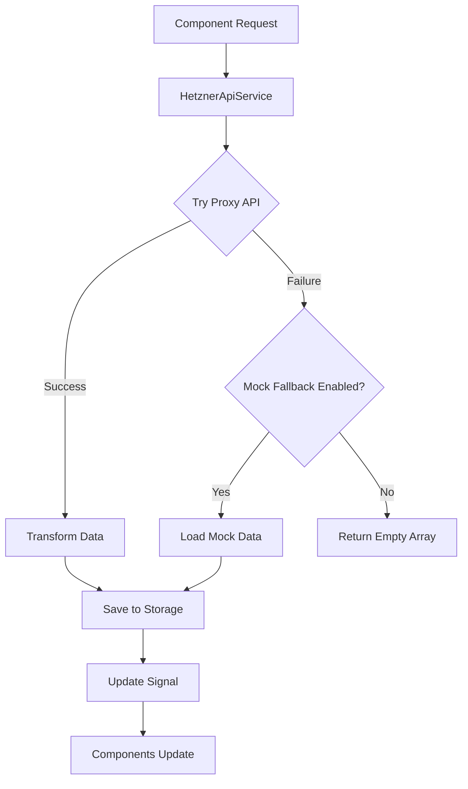

# Hetzner Cloud Dashboard Architecture

## Core Service Architecture

### API & Mock Data Flow


### Key Components

#### 1. HetznerApiService
- **Purpose**: Central service for all Hetzner Cloud API interactions
- **Location**: `/src/app/core/hetzner-api.service.ts`
- **Features**:
  - Automatic proxy/mock fallback
  - Signal-based state management
  - Unified data transformation
  - Caching through storage service

#### 2. DataStorageService
- **Purpose**: Unified storage for both mock and real API data
- **Location**: `/src/app/core/data-storage.service.ts`
- **Features**:
  - Session storage management
  - Consistent data format
  - Cache management
  - Error handling

#### 3. Environment Configuration
- **Location**: `/src/environments/`
- **Key Settings**:
  - `apiBase`: Proxy URL configuration
  - `useMockFallback`: Toggle mock data fallback

### Data Flow

1. **Initial Request**
   ```typescript
   loadResource(resource: string, signal: Signal, storageMethod: string)
   ```
   - First attempts proxy API request
   - Falls back to mock if needed
   - Updates storage and signals

2. **Data Storage**
   - All valid data is cached in SessionStorage
   - Consistent format maintained through storage service
   - Automatic data transformation on save/load

3. **State Management**
   ```typescript
   // Example signals
   servers = signal<Server[]>([]);
   loading = signal(false);
   error = signal<string | null>(null);
   ```

### API Endpoints

| Endpoint | Purpose | Mock Location |
|----------|---------|---------------|
| `/servers` | Server list | `/assets/mock/servers.json` |
| `/server_types` | Available configurations | `/assets/mock/server_types.json` |
| `/locations` | Data center locations | `/assets/mock/locations.json` |
| `/datacenters` | Datacenter information | `/assets/mock/datacenters.json` |
| `/images` | System images | `/assets/mock/images.json` |
| `/firewalls` | Firewall configurations | `/assets/mock/firewalls.json` |
| `/actions` | Server actions history | `/assets/mock/actions.json` |
| `/floating_ips` | IP management | `/assets/mock/floating_ips.json` |
| `/load_balancers` | Load balancer configs | `/assets/mock/load_balancers.json` |
| `/networks` | Network configurations | `/assets/mock/networks.json` |

### Error Handling

1. **API Errors**
   - Automatic fallback to mock data
   - Error signal updates
   - User notification through UI

2. **Mock Data Errors**
   - Fallback to empty arrays
   - Error logging
   - Consistent error state management

### Usage Example

```typescript
// Component
export class ServerListComponent {
  private api = inject(HetznerApiService);
  
  servers = this.api.servers; // Signal
  loading = this.api.loading; // Signal
  
  refresh() {
    this.api.loadServers();
  }
}
```

### Best Practices

1. **Data Loading**
   - Always use service methods for data requests
   - Let the service handle mode switching
   - Utilize signals for reactive updates

2. **Error Handling**
   - Check loading and error signals
   - Show appropriate UI feedback
   - Use mock fallback when appropriate

3. **State Management**
   - Use computed signals for derived data
   - Keep components thin
   - Leverage service for data transformations

### Development Workflow

1. **Adding New Features**
   ```typescript
   // 1. Add to models
   interface NewFeature {
     // ...
   }
   
   // 2. Add to service
   newFeature = signal<NewFeature[]>([]);
   
   // 3. Implement loading
   loadNewFeature(): void {
     // Use existing pattern
   }
   ```

2. **Testing**
   - Test both proxy and mock modes
   - Verify error handling
   - Check data transformation

3. **Maintenance**
   - Keep mock data up to date
   - Monitor API version changes
   - Update transformations as needed