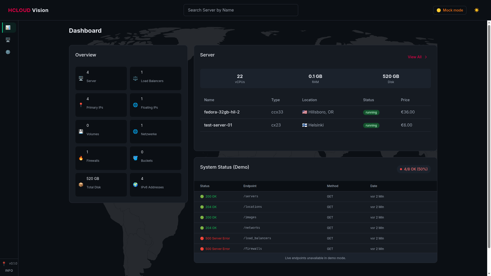
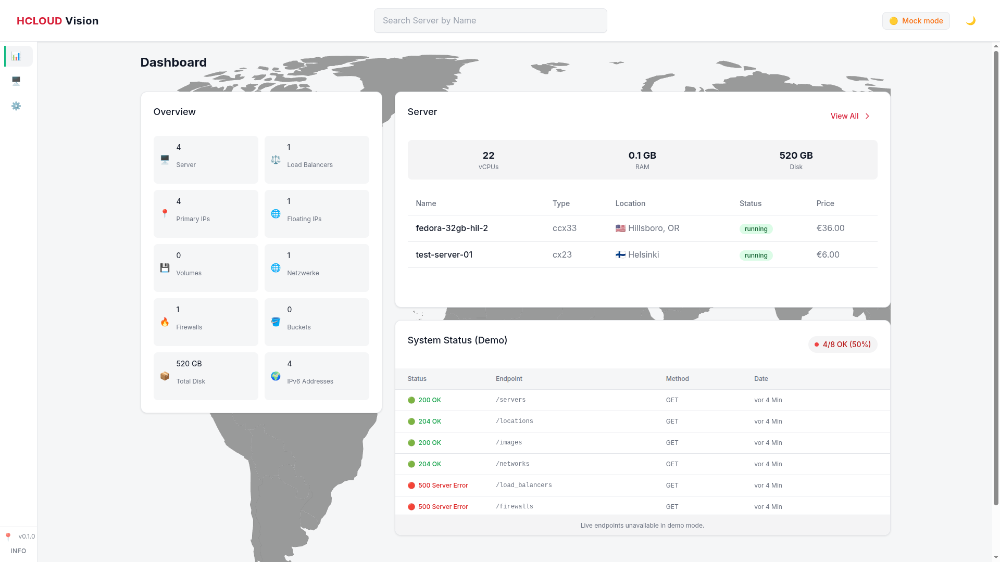
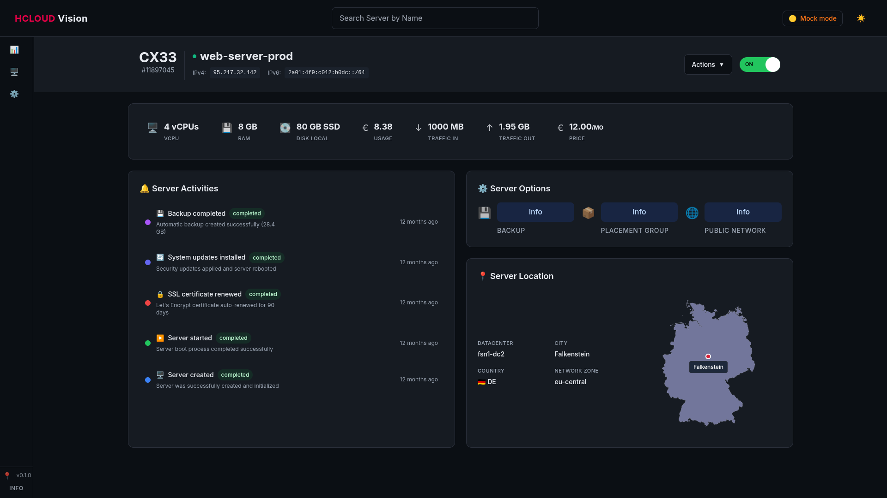
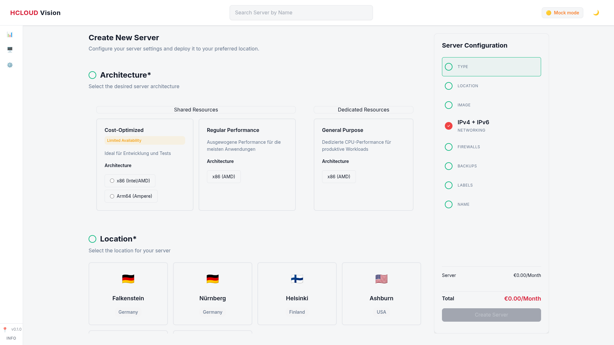

# Hetzner Cloud Angular Dashboard

Ein modernes Angular-Dashboard für die Verwaltung von Hetzner Cloud-Ressourcen mit vollständigem Demo-Modus und Live-API-Integration.



## 🚀 Funktionen

- **Server-Management**: Übersicht aller Server mit detaillierten Informationen
- **Dashboard**: Zusammenfassende Statistiken und System-Status
- **Demo-Modus**: Vollständig funktionsfähig mit Mock-Daten
- **Live-Modus**: Integration mit echter Hetzner Cloud API
- **Responsive Design**: Optimiert für Desktop und Mobile
- **CI/CD Pipeline**: Automatisierte Tests und Builds via GitHub Actions

## 📸 Screenshots

### Dashboard
| Light Mode | Dark Mode |
|------------|-----------|
|  |  |

### Server Management
| Server Details | Server Erstellen |
|----------------|------------------|
|  |  |

## 🎮 Anleitung zum selber ausprobieren

### Schnellstart (5 Minuten)
Probieren Sie das Dashboard sofort aus, ohne Setup oder Installation:

#### Option 1: Online Demo
```bash
# Direkt im Browser testen
https://hcloud.projects.prestonjones.dev/
```

**🌐 [Live Demo öffnen](https://hcloud.projects.prestonjones.dev/)**

#### Option 2: Lokale Installation
```bash
# 1. Repository klonen
git clone https://github.com/preston-jones/hcloud-angular-dashboard.git
cd hcloud-angular-dashboard

# 2. Abhängigkeiten installieren (dauert ~2 Minuten)
npm install

# 3. Anwendung starten
npm start

# 4. Browser öffnen
# http://localhost:4200
```

### Was Sie ausprobieren können

#### 🏠 Dashboard erkunden
1. **Öffnen Sie das Dashboard** - Überblick über alle Ressourcen
2. **System Status prüfen** - Rechts unten die Endpoint-Überwachung
3. **Statistiken ansehen** - Server-Anzahl, RAM, Disk-Space
4. **Dark/Light Mode** - Umschalten über das Theme-Icon

#### 🖥️ Server-Management testen
1. **Server-Liste öffnen** - Klick auf "Server" in der Sidebar
2. **Server-Details ansehen** - Klick auf einen Server
3. **Neuen Server erstellen** - "Create Server" Button (Demo-Modus)
4. **Filteroptionen nutzen** - Status, Typ, Region filtern

#### ⚙️ Einstellungen und Features
1. **Sidebar-Verhalten** - Pin/Unpin mit dem 📌 Button
2. **Suche testen** - Server über die Suchleiste finden
3. **Info-Dialog** - "INFO" Button für Impressum
4. **Responsive Design** - Bildschirmgröße ändern

#### 🔍 Erweiterte Features entdecken
1. **Mock-Daten erkunden** - Verschiedene Server-Status und Typen
2. **Aktivitäten-Log** - Server-Historie im Dashboard
3. **Navigation** - Alle Routen und Übergänge testen
4. **Performance** - Schnelle Ladezeiten und flüssige Animationen

### Testszenarien für Entwickler

#### Backend-Integration testen
```bash
# 1. Environment für Live-Modus konfigurieren
# src/environments/environment.ts bearbeiten

# 2. Cloudflare Worker URL setzen
export const environment = {
  apiUrl: 'https://your-worker.workers.dev',
  useCloudflareWorker: true
};

# 3. Anwendung mit Live-Daten starten
npm start
```

#### Tests ausführen
```bash
# Unit Tests starten
npm test

# Coverage Report generieren
npm run test:ci

# Linting prüfen
npm run lint

# Production Build testen
npm run build
```

#### CI/CD Pipeline testen
```bash
# 1. Fork des Repositories erstellen
# 2. Änderungen committen und pushen
# 3. GitHub Actions beobachten
# 4. Build-Artefakte herunterladen
```

### Häufige Fragen beim Ausprobieren

**Q: Warum sehe ich "Demo Mode" Hinweise?**
A: Die Anwendung läuft im Demo-Modus mit Mock-Daten. Für echte Daten benötigen Sie eine Cloudflare Worker-Integration.

**Q: Kann ich echte Server erstellen?**
A: Im Demo-Modus wird nur simuliert. Für echte Server-Erstellung benötigen Sie Live-API-Integration.

**Q: Wie ändere ich das Theme?**
A: Das Theme wechselt automatisch basierend auf Ihrer Betriebssystem-Einstellung (Dark/Light Mode).

**Q: Sind die Daten persistent?**
A: Im Demo-Modus werden Änderungen nicht gespeichert. Bei jedem Neustart werden die Original-Mock-Daten geladen.

### Tipps für das beste Erlebnis

1. **Nutzen Sie Chrome oder Firefox** für beste Kompatibilität
2. **Testen Sie auf verschiedenen Bildschirmgrößen** - die App ist vollständig responsive
3. **Probieren Sie alle Sidebar-Menüpunkte** aus
4. **Achten Sie auf kleine Details** wie Hover-Effekte und Animationen
5. **Prüfen Sie die Browser-Konsole** für eventuelle Entwickler-Informationen

## 📋 Voraussetzungen

- **Node.js** (Version 18 oder höher)
- **npm** (wird mit Node.js installiert)
- **Angular CLI** (optional, für erweiterte Entwicklung)

## 🛠️ Setup und Installation

### 1. Repository klonen
```bash
git clone https://github.com/preston-jones/hcloud-angular-dashboard.git
cd hcloud-angular-dashboard
```

### 2. Abhängigkeiten installieren
```bash
npm install
```

### 3. Entwicklungsserver starten
```bash
npm start
```

Die Anwendung ist dann unter `http://localhost:4200` verfügbar.

## 🎯 Modi der Anwendung

### Demo-Modus (Standard)
Im Demo-Modus verwendet die Anwendung statische Mock-Daten und simuliert alle API-Aufrufe.

**Verfügbare Mock-Daten:**
- Server-Daten (`/src/assets/mock/servers.json`)
- Aktivitäten (`/src/assets/mock/activities.json`)
- Rechenzentren (`/src/assets/mock/datacenters.json`)
- Server-Typen (`/src/assets/mock/server_types.json`)
- Preise (`/src/assets/mock/pricing.json`)
- Netzwerke, Firewalls, Load Balancer und weitere Ressourcen

**Eigenschaften des Demo-Modus:**
- Keine echten API-Aufrufe
- Vordefinierte Testdaten
- Alle Funktionen verfügbar
- Perfekt für Entwicklung und Präsentationen

### Live-Modus
Für die Verwendung mit echter Hetzner Cloud API ist eine Cloudflare Worker-Funktion erforderlich.

**Cloudflare Worker Setup:**
1. Erstellen Sie einen Cloudflare Worker
2. Implementieren Sie die Proxy-Funktion für Hetzner Cloud API
3. Konfigurieren Sie CORS-Header
4. Setzen Sie Ihren Hetzner Cloud API-Token

**Environment-Konfiguration:**
```typescript
// src/environments/environment.ts
export const environment = {
  production: false,
  apiUrl: 'https://your-cloudflare-worker.workers.dev',
  useCloudflareWorker: true
};
```

## 🏗️ Projektstruktur

```
src/
├── app/
│   ├── core/                    # Core Services und Utilities
│   │   ├── hetzner-api.service.ts
│   │   ├── data-storage.service.ts
│   │   └── mock-status.service.ts
│   ├── features/
│   │   ├── dashboard/           # Dashboard-Seite
│   │   └── servers/             # Server-Management
│   ├── shared/
│   │   ├── ui/                  # Wiederverwendbare UI-Komponenten
│   │   ├── services/            # Gemeinsame Services
│   │   └── models/              # TypeScript-Interfaces
│   └── environments/            # Umgebungskonfiguration
├── assets/
│   ├── mock/                    # Mock-Daten für Demo-Modus
│   ├── icons/                   # Icons und Grafiken
│   └── fonts/                   # Lokale Schriftarten
└── styles/                      # Globale Styles
```

## 🧪 Entwicklung und Tests

### Verfügbare Scripts
```bash
# Entwicklungsserver starten
npm start

# Tests ausführen
npm test

# Tests für CI/CD (ohne Watch-Modus)
npm run test:ci

# Production Build erstellen
npm run build

# Code-Linting
npm run lint
```

### Tests
Das Projekt verwendet Karma und Jasmine für Unit-Tests:
- **Komponenten-Tests**: Alle UI-Komponenten sind getestet
- **Service-Tests**: API-Services und Utilities
- **Code Coverage**: Mindestens 28% Abdeckung
- **CI/CD Integration**: Automatische Tests bei jedem Push

## 🔄 CI/CD Pipeline

Die GitHub Actions Pipeline führt automatisch folgende Schritte aus:

1. **Setup**: Node.js 20 Installation
2. **Dependencies**: npm ci für saubere Installation
3. **Linting**: Code-Qualitätsprüfung
4. **Tests**: Unit-Tests mit Coverage-Report
5. **Build**: Production Build erstellen
6. **Artifacts**: Build-Artefakte für Deployment

**Workflow-Datei:** `.github/workflows/ci.yml`

### Badge-Status
Die Pipeline erstellt automatisch Status-Badges für:
- Build-Status (✅ Passing / ❌ Failing)
- Test-Coverage (📊 Prozentsatz)
- Code-Qualität (📋 Linting-Status)

## 🎨 Technologie-Stack

- **Frontend**: Angular 20 mit TypeScript
- **Styling**: Tailwind CSS + SCSS
- **State Management**: Angular Signals
- **Testing**: Karma + Jasmine
- **Build Tool**: Angular CLI mit Vite
- **CI/CD**: GitHub Actions
- **Code Quality**: ESLint + Prettier

## 📊 Mock-Daten Details

### Server-Daten
```json
{
  "servers": [
    {
      "id": "111897044",
      "name": "test-server-01",
      "status": "running",
      "server_type": { "name": "cx31", "cores": 2, "memory": 8 },
      "datacenter": { "name": "ash-dc1" },
      "public_net": { "ipv4": { "ip": "192.0.2.1" } }
    }
  ]
}
```

### Aktivitäten
Jeder Server hat eine Historie von Aktivitäten wie:
- Server erstellt/gestartet/gestoppt
- Backups erstellt
- Firewall-Regeln aktualisiert
- System-Updates installiert

### System-Status
Mock-Endpoint-Status für Dashboard:
- API-Verfügbarkeit
- Response-Zeiten
- Fehlerquoten
- Service-Health

## 🚀 Deployment

### Lokaler Build
```bash
npm run build
# Ausgabe in dist/hcloud-angular-dashboard/
```

### Static Hosting
Das gebaute Projekt kann auf jedem Static Hosting Service deployt werden:
- **Netlify**: Drag & Drop aus dist-Ordner
- **Vercel**: GitHub-Integration
- **GitHub Pages**: Actions-basiertes Deployment
- **Cloudflare Pages**: Worker-Integration möglich

## 🔐 Sicherheit

### Demo-Modus
- Keine echten API-Tokens erforderlich
- Alle Daten sind statisch und sicher
- Keine Verbindung zu externen Services

### Live-Modus
- API-Token werden sicher über Cloudflare Worker verwaltet
- CORS-Schutz implementiert
- Keine direkten API-Aufrufe vom Client

## 📝 Lizenz

Copyright © 2025 Preston Jones

**Kontakt:**
- Website: [prestonjones.dev](https://prestonjones.dev)

## 🤝 Beitragen

1. Fork des Repositories erstellen
2. Feature-Branch erstellen (`git checkout -b feature/amazing-feature`)
3. Changes committen (`git commit -m 'Add amazing feature'`)
4. Branch pushen (`git push origin feature/amazing-feature`)
5. Pull Request erstellen

## 🆘 Troubleshooting

### Häufige Probleme

**Port bereits belegt:**
```bash
# Anderen Port verwenden
ng serve --port 4201
```

**Node.js Version:**
```bash
# Node.js Version prüfen
node --version
# Sollte >= 18.0.0 sein
```

**Build-Fehler:**
```bash
# Cache leeren und neu installieren
rm -rf node_modules package-lock.json
npm install
```

**Tests schlagen fehl:**
```bash
# Chrome Headless prüfen
npm run test:ci
```

Für weitere Unterstützung öffnen Sie ein Issue im GitHub Repository.